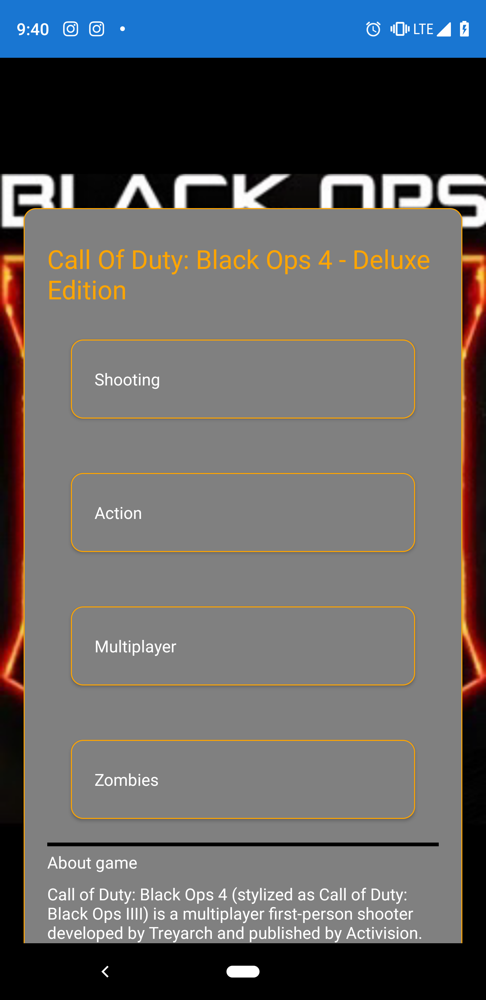

# Nombre de la aplicacion: LoginPSN

## Escritor: Alfredo Polanco
Ingenieria de software

## Requerimientos:

1. Visual Studio Comnunity Edition 2017
2. Xamarin.Forms Version 4.1.0.673156
3. Emulador Android o iOS

## Ejecucion:

1. Crear carpeta para descargar el proyecto

2. Clonar el repositorio 

    - git clone https://github.com/AlfredPolanco/LoginPSN.git

3. Acceder a la carpeta creada

    - cd /Carpeta/NombreCarpeta

4. Abrir .md con visual studio 

    - `code .`
       
5. Ejecutar la app con visual studio 

    
#

 
